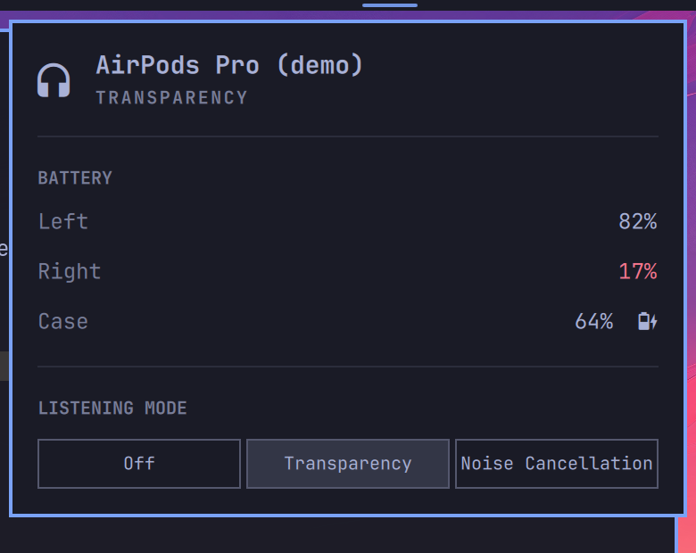

# Omarchy AirPods

An [Omarchy](https://omarchy.org/) 4.0 shell plugin that puts AirPods battery
levels on the bar and lets you switch listening mode (Off / Transparency /
Noise Cancellation) from a native panel.

Battery and ANC data come from
[MagicPodsCore](https://github.com/steam3d/MagicPodsCore), which speaks to the
AirPods over Bluetooth and exposes their state on a local WebSocket.



## Requirements

- Omarchy 4.0 or newer (the Quickshell-based `omarchy-shell`)
- `magicpodscore` running and paired with your AirPods:
  ```bash
  systemctl --user enable --now magicpodscore
  ```
- Python 3 (already present on Omarchy)

## Install

```bash
omarchy plugin add https://github.com/nicdal/omarchy-airpods.git --enable --yes
omarchy bar put community.airpods --section right
```

Plugins land disabled by default so you can read the code first; `--enable`
skips that. Drop it if you'd rather review before enabling.

To update later:

```bash
omarchy plugin update community.airpods
```

## What you get

**Bar widget** — a headphones glyph with the lower of the two buds' charge, and
a bolt when something is charging. It hides itself entirely when no AirPods are
connected.

**Panel** — click the widget for the device name, current listening mode, a
per-component battery breakdown (Left / Right / Case, or a single reading on
devices that only report one), and a row of pills for the listening modes the
device actually advertises. Percentages at or below 20% turn urgent.

Keyboard: `h`/`l` walk the listening-mode pills, `Enter` activates, `Esc`
closes, `Tab` moves to the next panel.

## Demo mode

Working on the panel with no AirPods to hand? Point the widget at a synthetic
device:

```bash
omarchy bar set community.airpods demo true --json
```

You get a fake connected device with all three listening modes, and clicking a
pill really does move the selection — the choice is kept in a small state file
under `$XDG_RUNTIME_DIR`. Turn it off with `demo false`.

The bridge can also be driven straight from a terminal:

```bash
~/.config/omarchy/plugins/community.airpods/airpods.py watch    # live device
~/.config/omarchy/plugins/community.airpods/airpods.py demo     # synthetic
~/.config/omarchy/plugins/community.airpods/airpods.py set-anc 2
```

## How it works

`airpods.py` holds one WebSocket to MagicPodsCore on `127.0.0.1:2020`, reduces
each update to a compact JSON line, and prints it only when something actually
changed. `Panel.qml` reads that stream with a `SplitParser` and renders it. The
script reconnects on its own, so the plugin survives `magicpodscore` restarts
without the shell having to poll.

Selecting a mode is optimistic: the pill moves immediately and is reconciled
when the daemon confirms, so a click never looks like it missed.

## License

MIT
