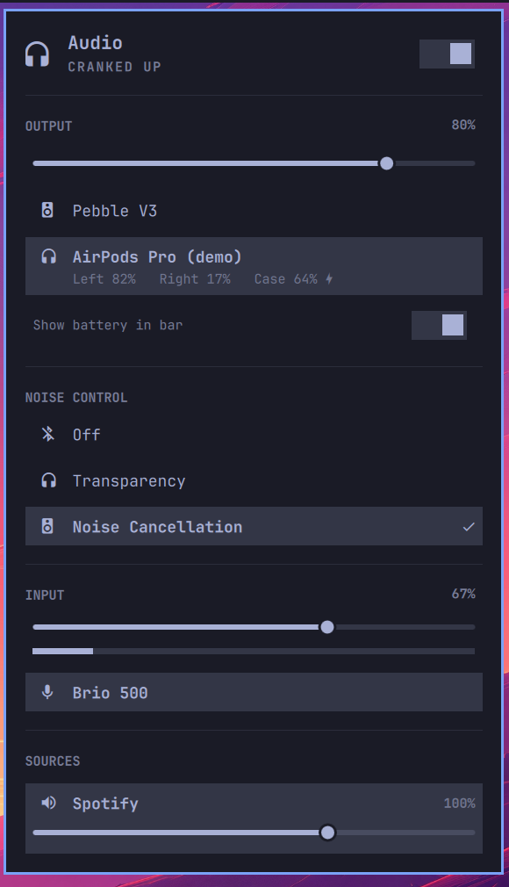

# Sound (AirPods mod)

[Omarchy](https://omarchy.org/) 4.0's Sound panel with AirPods battery levels and
listening-mode switching folded in — one Sound menu, the way macOS does it,
instead of a second bar widget.

It replaces the stock `omarchy.audio` widget. Volume, output picker and per-app
mixer behave exactly as before; the AirPods parts appear only when there are
AirPods to talk about.

 

Battery and listening modes come from
[MagicPodsCore](https://github.com/steam3d/MagicPodsCore) over a local WebSocket.

## Install

You need Omarchy 4.0+, Python 3 (already there), and `magicpodscore`.

**1. The backend.** `magicpodscore` reads your headphones from bluez over D-Bus,
so there's no pairing step of its own — pair them the ordinary way and it finds
them. The package ships no systemd unit, so add
`~/.config/systemd/user/magicpodscore.service`:

```ini
[Unit]
Description=MagicPodsCore - AirPods battery and controls
After=bluetooth.target

[Service]
ExecStart=/usr/bin/magicpodscore
Restart=on-failure
RestartSec=5

[Install]
WantedBy=default.target
```

```bash
omarchy pkg aur add magicpodscore
systemctl --user daemon-reload
systemctl --user enable --now magicpodscore
```

**2. The plugin.**

```bash
omarchy plugin add https://github.com/nicdal/omarchy-sound-airpods-mod.git --enable --yes
omarchy bar put community.sound-airpods-mod
omarchy bar move community.sound-airpods-mod --section right
```

**3. Remove the stock widget** it replaces, or you'll have two: delete the
`omarchy.audio` entry from `bar.layout` in `~/.config/omarchy/shell.json`.

Update later with `omarchy plugin update community.sound-airpods-mod`.

## What it adds

**Battery**, as a subline under the device in the output list — `Left`, `Right`
and `Case` on AirPods and AirPods Pro, a single reading on models like the Max.
A bolt marks charging, and readings the device doesn't report are left out
rather than shown as 0%.

**Noise Control**, listing only the modes your device advertises, with a tick on
the live one. It appears only while the headphones are the selected output.

**Show battery in bar** — a switch in the panel, off by default so the bar looks
stock. Turn it on and the bar icon gains the reading (the lowest bud, ignoring
the case). Remembered across reboots.

Connect nothing and the panel is identical to the stock one — no empty sections.

## Notes

Both options can also be set from the command line:

```bash
omarchy bar set community.sound-airpods-mod showBattery true --json

# Preview the panel against a synthetic device, with no headphones to hand.
omarchy bar set community.sound-airpods-mod demo true --json
```

MagicPodsCore doesn't expose Spatial Audio or Conversation Awareness, so those
parts of the macOS menu can't be reproduced. Media volume isn't a headphone
setting either — it's PipeWire, which the panel's existing slider already
controls.

`Panel.qml` and `Model.js` are vendored from Omarchy's first-party
`omarchy.audio` (MIT — see [LICENSE](LICENSE)), because the shell has no API for
one plugin to add a section to another's panel; copying is the supported route.
Additions are marked `AirPods mod` so they stay easy to diff against upstream —
though it does mean upstream improvements need merging by hand.

The added rows are mouse-driven, staying out of the panel's keyboard cursor
model, which is indexed against the audio device lists.

## License

MIT. Includes code from [Omarchy](https://omarchy.org/) (MIT), see
[LICENSE](LICENSE).
